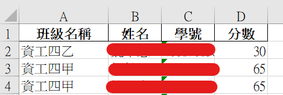

# Auto Rating
## How to download
```shell
git clone https://github.com/weiawesome/auto_rating.git
```
## How to install dependency
```shell
pip install -r requiremnets.txt
```
## How to prepare files
### Reference Files
```
├── reference_files
│   ├── index.html
│   ├── name_list.xlsx
```
1. Build the Directory reference_files
2. Inert the file index.html
   * It is the result file in student test.
3. Inert the file name_list.xlsx
   * It is the file professor give the students who study in the class.
### Result Files
```
├── result
│   ├── result.xlsx
```
1. Build the Directory result
2. It will save in the directory named result.xlsx

## How to start
```shell
python main.py
```

## How to edit the parameters
```python
# ./main.py

# Number of test question
num = 5
# Each of data not pass then minus score. 
penalty = 5
# The number of student correct correspond to score
## ex.
##      student correct 0 problem gain 30 point
##      student correct 1 problem gain 50 point
##      student correct 2 problem gain 70 point
##      student correct 3 problem gain 80 point
##      student correct 4 problem gain 90 point
##      student correct 5 problem gain 100 point
score = [30, 50, 70, 80, 90, 100]
```

## Result file
**File :** ./result/result.xlsx


